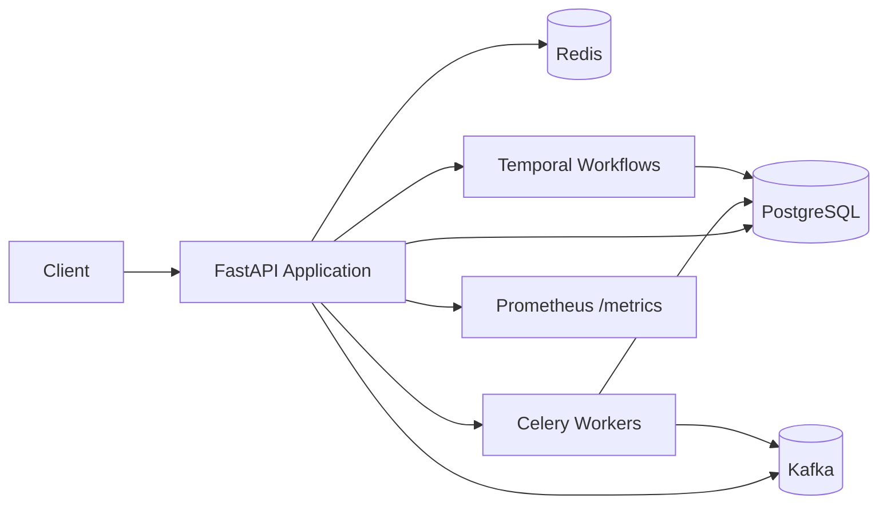

# SmartHealth

SmartHealth is a healthcare scheduling and operations platform built with FastAPI. It enables patient booking workflows, provider/service management, department organization, appointment lifecycle tracking, and operational observability in a single backend system.

## Overview

The platform includes:

- secure authentication and role-based authorization
- patient, provider, department, and service management
- slot publishing and reservation workflows
- appointment creation, rescheduling, cancellation, and visit tracking
- billing pre-check support
- asynchronous workflow processing through Temporal and Celery
- structured logging, correlation IDs, and Prometheus metrics

## Core capabilities

- patient onboarding and authentication flows
- provider and department configuration
- service catalog publishing and status tracking
- slot-based scheduling and availability checks
- appointment booking with idempotency protection
- audit-friendly observability across HTTP, worker, and workflow boundaries

## Architecture summary

SmartHealth is organized into a modular FastAPI service with clear domain boundaries:

- API layer: request handling, routing, auth, and public endpoints
- service layer: business logic and workflow orchestration
- repository layer: persistence and data access
- schema layer: request/response validation with Pydantic
- workflow layer: Temporal-oriented orchestration for complex flows
- background workers: Celery task execution and integrations
- observability layer: structured logging, correlation IDs, and metrics



## Technology stack

- FastAPI for HTTP APIs and Swagger/OpenAPI documentation
- SQLAlchemy for ORM/data access
- PostgreSQL for persistent application data
- Redis for idempotency and shared operational state
- Celery for background workers and async execution
- Kafka for event-driven integration patterns
- Temporal for workflow orchestration and saga-style flows
- Prometheus + prometheus-client for metrics and scraping
- Alembic for database versioning and migration management

## Quick start

### 1. Start the complete demo

```bash
docker compose up --build
```

This starts PostgreSQL, Redis, Kafka, Temporal, the API, Celery, the Temporal worker, and the analytics consumer. The API container applies migrations and seeds the demo accounts before serving traffic. Open `http://localhost:8000/docs` to run the flows.

To run the application manually instead, continue with the steps below.

### 2. Configure environment

Copy the example environment file and update values as needed:

```bash
copy .env.example .env
```

### 3. Start supporting infrastructure

```bash
docker compose up -d
```

This brings up the main dependencies required by the platform:

- PostgreSQL
- Redis
- Kafka
- Temporal

### 4. Install dependencies

```bash
pip install -r requirements.txt
```

### 5. Apply database migrations

```bash
alembic upgrade head
```

### 6. Start the API service

```bash
uvicorn app.main:app --reload
```

### 7. Start background workers

```bash
celery -A app.celery_app worker --loglevel=info
```

### 8. Start Temporal workflow worker if required

```bash
python -m app.workers.service_publish_worker
```

## API overview

### Authentication

- `POST /auth/register`
  - creates a user account
  - supported roles: `patient`, `provider`, `front_desk`, `admin`

- `POST /auth/login`
  - validates credentials
  - returns an access token

### Health and monitoring

- `GET /health`
  - liveness check for the API

- `GET /metrics`
  - Prometheus-formatted metrics endpoint

- `GET /docs`
  - Swagger UI for API inspection and manual testing

### Core domain APIs

#### Departments

- `POST /api/v1/departments`
- `GET /api/v1/departments`

#### Providers

- `POST /api/v1/providers`
- `GET /api/v1/providers`
- `GET /api/v1/providers/{provider_id}/slots`

#### Services

- `POST /api/v1/services`
- `POST /api/v1/services/{service_id}/publish`
- `POST /api/v1/services/{service_id}/unpublish`
- `GET /api/v1/services/{service_id}/publish-status`
- `GET /api/v1/services`

#### Slots

- `POST /api/v1/slots`
- `POST /api/v1/slots/{slot_id}/reserve`
- `GET /api/v1/slots`

#### Appointments

- `POST /api/v1/appointments`
- `GET /api/v1/appointments/{appointment_id}/state`
- `POST /api/v1/appointments/{appointment_id}/cancel`
- `POST /api/v1/appointments/{appointment_id}/reschedule`
- `POST /api/v1/appointments/{appointment_id}/billing/pre-check`
- `POST /api/v1/appointments/{appointment_id}/visit/check-in`
- `POST /api/v1/appointments/{appointment_id}/visit/start`
- `POST /api/v1/appointments/{appointment_id}/visit/complete`

#### Public catalog

- `GET /api/v1/public/services`
  - public listing of published services

## Environment variables

Copy `.env.example` to `.env` for local Docker execution. The important settings are:

| Variable | Purpose |
| --- | --- |
| `DATABASE_URL` | SQLAlchemy database connection |
| `JWT_SECRET` | Signing key for access tokens |
| `TEMPORAL_HOST` | Temporal frontend address |
| `TEMPORAL_TASK_QUEUE` | Shared workflow task queue |
| `REDIS_URL` | Idempotency store connection |
| `CELERY_BROKER_URL` | Celery broker connection |
| `KAFKA_ENABLED` | Enables Kafka event publishing |
| `KAFKA_BOOTSTRAP_SERVERS` | Kafka broker address |
| `EMBEDDING_PROVIDER` | Service search embedding backend |
| `RETRIEVAL_TOP_K` | Maximum semantic search results |

## Operational patterns

### Role-based access control

Access is enforced by roles to keep the system secure and operationally consistent:

- patient: booking and personal profile access
- provider: provider profile, slot, and service access
- front_desk: operational catalogue and support workflows
- admin: full administrative control

### Idempotency

The appointment flow uses the `Idempotency-Key` header to safely prevent duplicate booking requests from creating duplicate records.

### Workflow orchestration

The service publishing and appointment workflows are designed to handle complex multi-step flows with compensation and state tracking.

### Observability

The platform includes:

- structured JSON logs
- correlation IDs across HTTP, Celery, and workflow boundaries
- Prometheus metrics endpoint and counters
- task execution monitoring

## Seed data

Use the application seed script to populate sample records for local development:

```bash
docker compose run --rm api python -m app.seed
```

Sample accounts include:

- admin@example.com / secret123
- provider@example.com / secret123
- patient@example.com / secret123

## Testing

Run the test suite with:

```bash
pytest -q
```

Common development commands are also available through the `Makefile`:

```bash
make demo
make test
make lint
```

The Temporal entrypoint is `python -m app.workers.temporal.worker`; all workflows, tasks, and consumers reside consolidated under `app/workers/` (with Temporal workflows under `app/workers/temporal/`). Operational helpers live under `scripts/`.

## Documentation index

- [docs/design.md](docs/design.md) — system design and domain model overview
- [docs/STRUCTURED_LOGGING.md](docs/STRUCTURED_LOGGING.md) — structured logging and correlation tracing
- [docs/events.md](docs/events.md) — event contracts and integration patterns
- [docs/runbook.md](docs/runbook.md) — operational start-up and incident response guidance
- [docs/prd.md](docs/prd.md) — demo requirements and success criteria
- [docs/diagrams/architecture.md](docs/diagrams/architecture.md) — architecture diagram

## Notes

- configuration is managed through environment variables and `.env`
- authenticated API routes are versioned under `/api/v1`
- public catalog endpoints are intentionally separated from authenticated operational routes
- the API and service layers are designed to remain testable, traceable, and maintainable in an enterprise environment
