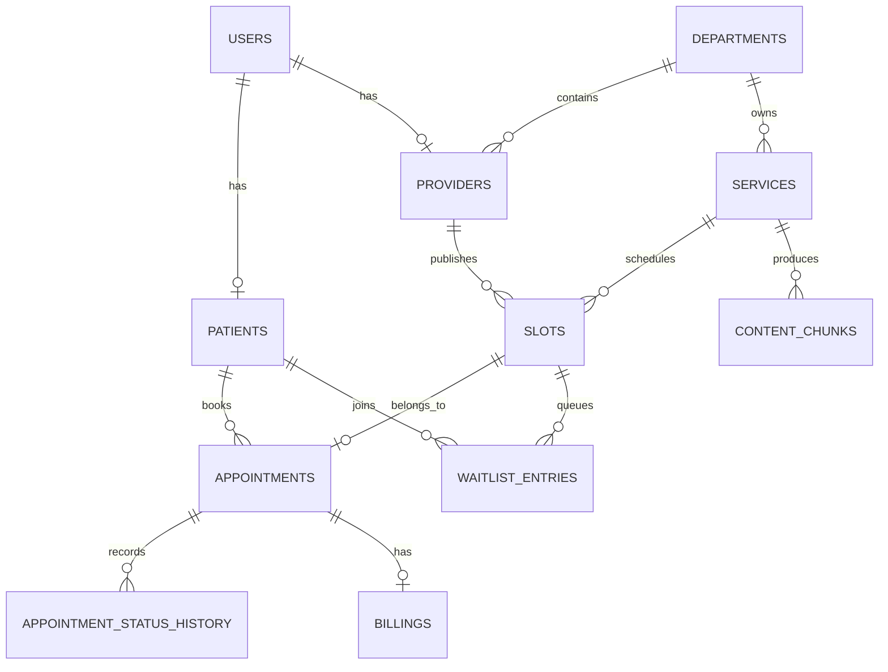
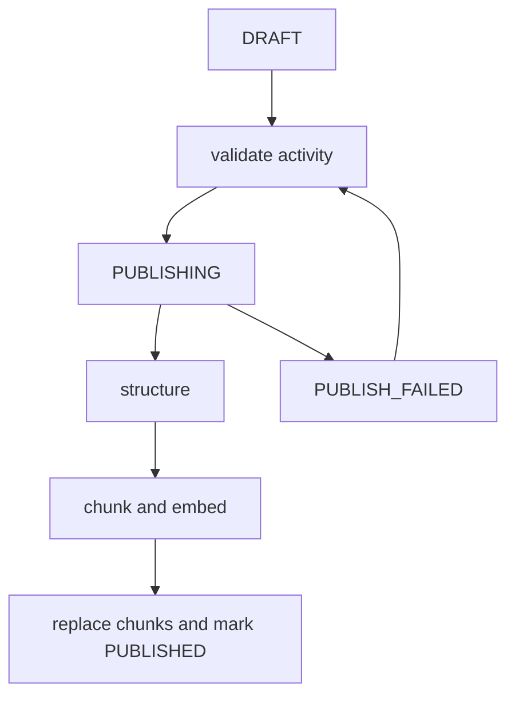

# SmartHealth Design

## Module breakdown

- `app/api`: FastAPI routes, authentication dependencies, authorization, and HTTP contracts.
- `app/core`: settings, JWT security, structured logging, correlation IDs, exceptions, metrics, and Redis idempotency.
- `app/db`: SQLAlchemy engine/session and declarative base.
- `app/models`: users, patients, providers, departments, services, slots, appointments, billing, waitlist, audit, content, and analytics tables.
- `app/schemas`: Pydantic request and response contracts.
- `app/repositories`: database operations and transaction boundaries. Business writes are centralized here.
- `app/services`: application services for billing, analytics, service management, and events.
- `app/workflows`: Temporal workflow and activity implementations; `app/temporal` is the public worker entrypoint surface.
- `app/workers`: Celery tasks and Kafka analytics consumer.

## Data model



`AuditLog` records entity, action, before/after metadata, and actor ID for provider, service, slot, and appointment mutations. It is added through repositories in the same transaction as the business mutation.

## Service publishing workflow

`DRAFT -> PUBLISHING -> PUBLISHED`. An incomplete service is marked `PUBLISH_FAILED` and returns all validation errors. Temporal activities validate completeness, structure operational text, chunk description and preparation instructions, generate embeddings, replace the service chunks, and mark the service published. The unique `(service_id, chunk_index)` constraint and replacement operation prevent duplicate chunks after retries.



## Scheduling saga

The booking workflow creates a `REQUESTED` appointment, atomically changes the slot to `RESERVED`, records `SLOT_RESERVED`, runs the billing checker, schedules a reminder, and records `CONFIRMED`. Any failure after reservation releases the slot and changes the pending appointment to `CANCELLED`; history is retained.

The consistency boundary is:

```sql
UPDATE slots
SET status = 'RESERVED', patient_id = :patient_id
WHERE id = :slot_id AND status = 'AVAILABLE';
```

The affected-row count is the result. A select-then-update races because two transactions can both observe `AVAILABLE` before either writes. Rescheduling uses the same conditional claim for the replacement slot before releasing the old slot, and rolls back if the new slot was already claimed.

Redis idempotency is keyed by authenticated user and `Idempotency-Key`. The appointment unique slot constraint and atomic reservation protect the database during concurrent requests.

## Key tradeoffs

- PostgreSQL is the production database because conditional updates, unique constraints, and pgvector are first-class requirements. SQLite remains useful for fast tests and migration checks.
- Kafka events are published after successful commits. This prevents a broker outage from rolling back committed business data, but can create delivery lag; an outbox is the next production hardening step.
- Temporal owns durable orchestration and retries. Database work remains in activities so replay remains deterministic.
- Repository-level writes centralize consistency and audit behavior at the cost of more explicit application code.
- The local fallback supports development without Temporal; Compose starts the real Temporal worker.
