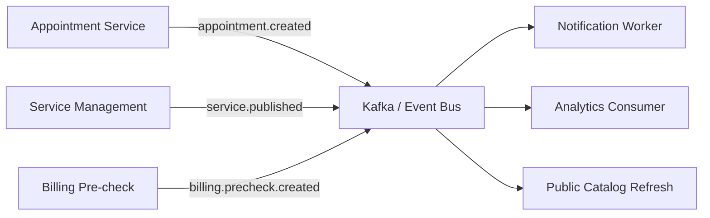

# Event Contracts and Integration Guide

## Overview

SmartHealth emits and consumes domain events to support asynchronous workflows, notification delivery, analytics processing, and event-driven integrations. This document defines the canonical event model and the operational expectations for event producers and consumers.

The system uses a combination of internal service events and asynchronous messaging patterns through Kafka and Celery. Event payloads are intentionally limited to operational metadata and must never contain PHI or personally identifiable user data beyond the minimum required identifiers.

## Event Principles

- events are immutable records of meaningful business changes
- event names are descriptive and business-oriented
- payloads are minimal and safe for operational telemetry
- consumers are expected to perform idempotent handling
- failures should be retried or logged to the failed-job mechanism
- PII/PHI is not included in event payloads

## Event Catalog

### appointment.created

Producer:
- appointment booking workflow / service layer

Trigger:
- a patient appointment is successfully created

Payload:
- appointment_id
- patient_id
- provider_id
- service_id
- slot_id
- status
- timestamp

Usage:
- downstream reminder processing
- analytics aggregation
- operational dashboards

---

### appointment.cancelled

Producer:
- appointment cancellation flow

Trigger:
- an appointment is cancelled successfully

Payload:
- appointment_id
- patient_id
- provider_id
- slot_id
- status
- timestamp

Usage:
- slot release notifications
- analytics and operational reporting

---

### appointment.visit_status_changed

Producer:
- appointment service visit transition flow

Trigger:
- a visit status changes, such as CHECKED_IN, IN_PROGRESS, or COMPLETED

Payload:
- appointment_id
- patient_id
- provider_id
- service_id
- slot_id
- status
- visit_status
- timestamp

Usage:
- provider workflow updates
- operational monitoring
- visit analytics

---

### service.published

Producer:
- service publish workflow

Trigger:
- a service is successfully published

Payload:
- service_id
- department_id
- provider_id
- status
- timestamp

Usage:
- public catalogue refresh
- search/index synchronization
- internal service indexing

---

### service.unpublished

Producer:
- service management flow

Trigger:
- a published service is withdrawn from public access

Payload:
- service_id
- department_id
- provider_id
- status
- timestamp

Usage:
- public catalogue updates
- downstream cache invalidation

---

### billing.precheck.created

Producer:
- appointment billing pre-check step

Trigger:
- a billing pre-check is created for a booking

Payload:
- appointment_id
- billing_id
- status
- amount
- timestamp

Usage:
- billing pipeline processing
- financial reconciliation

## Event Flow Model



## Producer Responsibilities

- emit a single event per meaningful business outcome
- include only required identifiers and safe status values
- log correlation IDs with each emitted event
- use idempotent publishing where appropriate
- handle failures using retries and dead-letter/failure tracking

## Consumer Responsibilities

- validate payload integrity before processing
- treat processing as idempotent where possible
- record failures with task/job metadata
- use correlation ID to trace request and workflow lineage
- avoid exposing sensitive data in consumer logs

## Operational Controls

### Retry and failure handling

- Celery task failures are tracked through the failed job service
- event processing failures should be logged with stack trace and metadata
- retries must be bounded and follow backoff policies

### Observability

Each event path should include:
- correlation_id
- request_id
- task_id or workflow_id
- event name
- timestamp
- result or failure status

## Security Notes

- never emit PHI or raw patient contact data in event payloads
- keep business identifiers at the minimum required for downstream processing
- protect event topic access using infrastructure-level credentials
- use environment-specific topics for dev, staging, and prod

## Example Event Envelope

```json
{
  "event_name": "appointment.created",
  "timestamp": "2026-08-17T10:30:00Z",
  "correlation_id": "c8d8f10c-1f2a-4bbd-b6d1-7b4714baf132",
  "payload": {
    "appointment_id": 101,
    "patient_id": 23,
    "provider_id": 7,
    "service_id": 14,
    "slot_id": 55,
    "status": "BOOKED"
  }
}
```

## Recommended Standards

- use clear business names, not implementation names
- keep events versioned when contract changes are necessary
- document event contract changes in release notes
- add schema validation before production usage for critical event channels

## Related Documentation

- [design.md](design.md)
- [STRUCTURED_LOGGING.md](STRUCTURED_LOGGING.md)
- [runbook.md](runbook.md)
